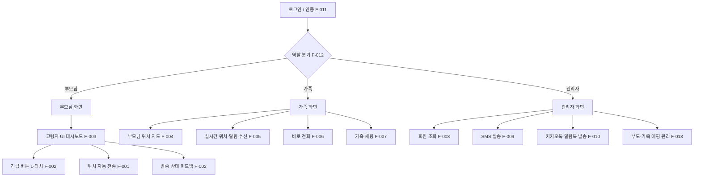
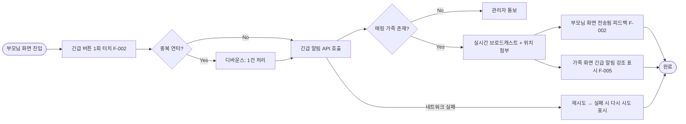
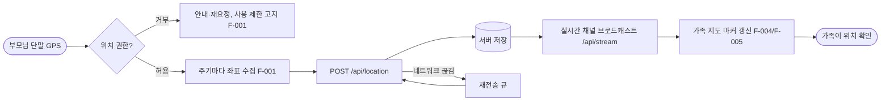
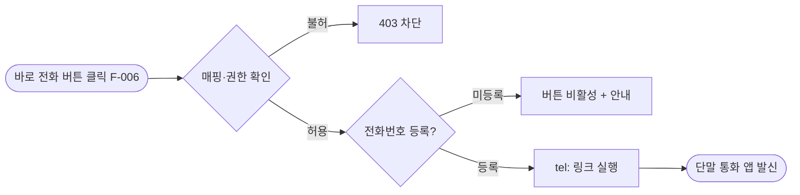
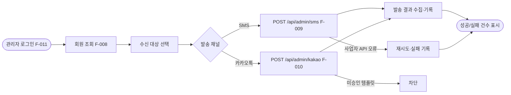
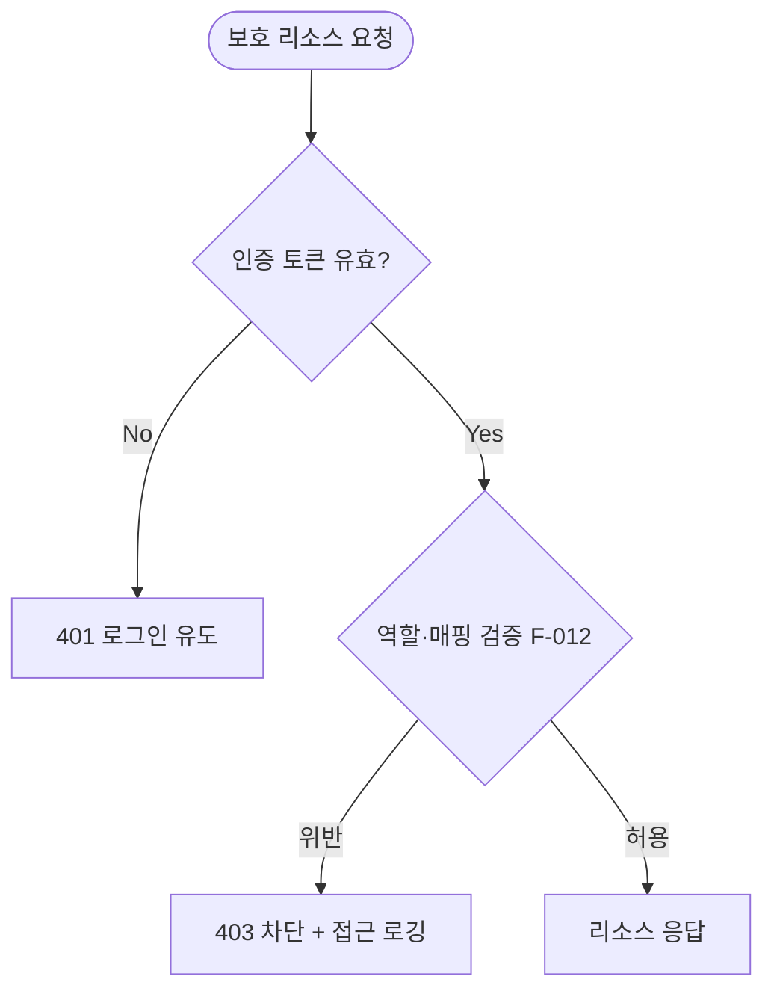

# 정보구조도 (Information Architecture)

**프로젝트명**: 부모님 위치 확인 서비스
**작성일**: 2026-06-09
**버전**: v1.0
**작성자**: kbt8918 (기획자)
**근거 자료**: 기능명세서.md(v1.0), 요구사항정의서.md(v1.0)

> 본 문서는 기능명세서의 화면(부모님/가족/관리자)과 단위 기능(F-001~F-014)을 사이트맵·사용자 흐름·화면-기능 매핑으로 구조화한다.
> 본 문서의 결과는 화면설계서(#9)의 입력 자료가 된다.
> 역할별 진입은 권한 분리(F-012)에 따라 분기된다: 부모님 / 가족 / 관리자.

---

## 1. 전체 사이트맵

> 모든 화면은 반응형 레이아웃(F-014)으로 PC/태블릿/모바일에 대응하며, 부모님 화면은 모바일 우선·핵심 버튼 유지.

---

## 2. 사용자 흐름 (User Flow)

### 2.1 긴급 알림 흐름 (부모님 → 가족)

### 2.2 실시간 위치 확인 흐름 (부모님 → 가족)

### 2.3 바로 전화 흐름 (가족)

### 2.4 관리자 발송 흐름 (회원 관리)

### 2.5 인증·권한 분리 흐름 (공통)

---

## 3. 화면-기능 매핑

| 화면명 | URL(예시) | 주요 기능 | 관련 기능 ID |
|--------|-----------|-----------|-------------|
| 로그인 | `/login` | 로그인·인증, 역할 분기 | F-011, F-012 |
| 부모님 화면 | `/parent` | 고령자 UI, 긴급 알림, 위치 전송, 발송 피드백 | F-001, F-002, F-003 |
| 가족 화면 | `/family` | 위치 지도, 실시간 수신, 바로 전화, 가족 채팅 | F-004, F-005, F-006, F-007 |
| 가족 채팅방 | `/family/chat/:roomId` | 가족 채팅 송수신 | F-007 |
| 관리자 화면 | `/admin` | 회원 조회, SMS·카카오 발송, 매핑 관리 | F-008, F-009, F-010, F-013 |
| (공통 레이아웃) | 전체 | 반응형 레이아웃, 권한 분리 | F-014, F-012 |

---

## 4. 정보 분류 체계 (역할 기준)

| 역할 | 접근 가능 정보 | 차단 정보 |
|------|----------------|-----------|
| 부모님(위치 제공자) | 자신의 긴급 버튼·발송 상태 | 가족 위치·관리자 기능 |
| 가족(위치 확인자) | 매핑된 부모님 위치·알림·전화번호·가족 채팅 | 비매핑 부모님 데이터·관리자 기능 |
| 관리자(운영자) | 회원·매핑 정보(마스킹), 발송 기능 | 위치 원본 상시 열람(최소수집 원칙 OI-04) |

---

**작성 완료 여부**: [x] 정보구조도 작성 완료 (기능명세서 v1.0 기반, 사이트맵 + 5개 사용자 흐름 + 화면-기능 매핑)

**승인**:
- [ ] 정보구조도 승인 (User Sign-off)
