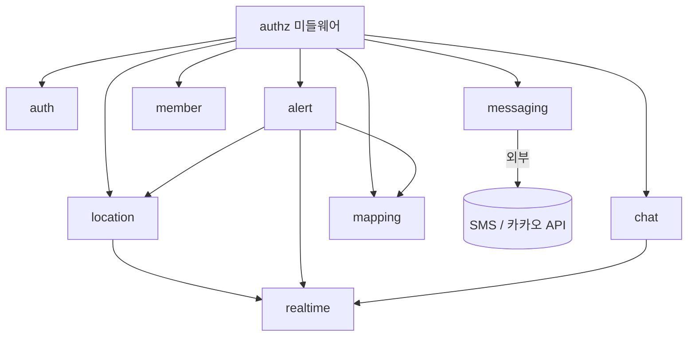

<style>
@media print {
    body, p, li { font-size: 13pt !important; line-height: 1.6 !important; }
    h1 { font-size: 22pt !important; margin-top: 22pt !important; margin-bottom: 14pt !important; }
    h2 { font-size: 18pt !important; margin-top: 18pt !important; margin-bottom: 12pt !important; }
    h3 { font-size: 16pt !important; margin-top: 16pt !important; margin-bottom: 10pt !important; }
    ul, ol { margin-top: 5pt !important; margin-bottom: 5pt !important; padding-left: 22pt !important; }
}
</style>

# 시스템 정의서 (System Definition)

**프로젝트명**: 부모님 위치 확인 서비스
**작성일**: 2026-06-09
**버전**: v1.0
**작성자**: kbt8918 (기획자)
**근거 자료**: 기능명세서.md(v1.0), API스펙.md(v1.0), CLAUDE.md(Tech Stack V0.42)

> 본 문서는 기능명세서의 F-001~F-014를 구현하기 위한 기술 스택·모듈 구성·인터페이스 규약을 정의한다.
> 배치 전략: M1~M4 통합 단계 — API는 Next.js Route Handlers(`src/frontend/app/api/*`), Vercel 통합 배포, `src/backend/`는 빈 폴더로 유지(M5+ Express 분리).

---

## 1. 기술 스택

> V0.42 표준 스택: `Next.js + Tailwind CSS / Express.js / PostgreSQL / Vercel`

| 영역 | 기술 | 버전 | 비고 |
|------|------|------|------|
| Frontend | Next.js (App Router) + Tailwind CSS | 14.x / 3.x | V0.42 표준, 반응형 레이아웃(F-014) |
| Backend(API) | Next.js Route Handlers | 14.x | M1~M4 통합. M5+ 시 Express.js 분리 |
| Database | PostgreSQL (Supabase) | 15.x | 회원·매핑·위치·채팅 저장 |
| 실시간 | SSE(`/api/stream`) 또는 Supabase Realtime | - | 위치 갱신·긴급 알림·채팅(F-002/F-005/F-007) |
| 인증 | JWT + bcryptjs | - | 비밀번호 해시 bcryptjs(F-011) |
| 지도 | 카카오/네이버/Google Maps JS SDK | - | 부모님 위치 마커(F-004), 외부 키 OI-05 |
| Geolocation | 브라우저 Geolocation API | - | 부모님 단말 위치 수집(F-001) |
| 외부 발송 | SMS 사업자 API, 카카오톡 알림톡 API | - | F-009/F-010, 외부 키 OI-05 |
| Deploy | Vercel | - | Frontend + API Routes 통합 |
| CI/CD | GitHub Actions | - | 표준 |

> Vercel 배포 시 알려진 이슈 주의: `!` Body Escaping, bcrypt→bcryptjs, Supabase IPv6, `service_role` 키 프론트 노출 금지(NFR-002).

---

## 2. 모듈 구성

| 모듈명 | 역할 | 관련 기능 | 의존성 |
|--------|------|-----------|--------|
| auth | 로그인·로그아웃, JWT 발급, 역할 식별 | F-011 | db, bcryptjs |
| authz(middleware) | 전 API 공통 역할·매핑 검증, 접근 차단·로깅 | F-012 | auth, db |
| location | 위치 수집·저장·조회·브로드캐스트 | F-001, F-004 | db, realtime |
| alert | 긴급 알림 발송·브로드캐스트(디바운스) | F-002 | location, realtime, mapping |
| realtime | SSE/Realtime 채널 구독·이벤트 발행 | F-005, F-002, F-007 | authz |
| chat | 채팅 메시지 저장·전파·이력 조회 | F-007 | db, realtime, authz |
| member | 회원 조회, 전화번호 조회(마스킹) | F-006, F-008 | db, authz |
| mapping | 부모-가족 매핑 생성/조회/해제 | F-013 | db, authz |
| messaging | SMS·카카오 알림톡 외부 발송, 결과 기록 | F-009, F-010 | 외부 API, authz |
| ui-parent | 고령자 UI 화면(큰 버튼·큰 글씨·고대비) | F-003 | frontend |
| ui-common | 반응형 레이아웃, 화면 분기 | F-014 | frontend |



---

## 3. 디렉토리 구조

```
src/
└── frontend/                # Next.js + Tailwind (M1~M4 통합)
    ├── app/
    │   ├── login/           # 로그인 화면 (F-011)
    │   ├── parent/          # 부모님 화면 (F-001~F-003)
    │   ├── family/          # 가족 화면 (F-004~F-007)
    │   │   └── chat/        # 가족 채팅 (F-007)
    │   ├── admin/           # 관리자 화면 (F-008~F-010, F-013)
    │   └── api/             # Route Handlers (API스펙 API-001~015)
    │       ├── auth/        #   login, logout (F-011)
    │       ├── location/    #   위치 전송·조회 (F-001, F-004)
    │       ├── stream/      #   SSE 실시간 채널 (F-005)
    │       ├── alert/       #   긴급 알림 (F-002)
    │       ├── chat/        #   채팅 (F-007)
    │       ├── member/      #   전화번호 조회 (F-006)
    │       ├── mapping/     #   매핑 (F-013)
    │       └── admin/       #   members, sms, kakao (F-008~F-010)
    ├── components/          # 공용 UI (반응형, 고령자 UI)
    ├── lib/                 # auth, authz, db, realtime, messaging 유틸
    └── styles/
src/backend/                 # 빈 폴더 (M5+ Express 분리 시 사용)
tests/                       # 단위·통합 테스트 (테스트시나리오 #15 기반)
```

---

## 4. 인터페이스 규약

| 항목 | 규칙 |
|------|------|
| 요청 인증 | `Authorization: Bearer {JWT}` (로그인 제외 전 보호 API) |
| 응답 형식 | `{ "status": "success"\|"error", "data"\|"error": {...} }` (API스펙 1.1) |
| 실시간 이벤트 | SSE `event: location` / `event: emergency` / 채팅 채널 메시지 |
| 권한 검증 | 모든 보호 요청은 authz 미들웨어 통과(역할 + 매핑 범위) |
| 위치 데이터 | 최소수집(OI-04), 전송 암호화, 마지막 위치 fallback 허용 |

---

## 5. 코딩 컨벤션

| 항목 | 규칙 |
|------|------|
| 네이밍 | 변수/함수 camelCase, 컴포넌트 PascalCase, DB 컬럼 snake_case |
| 들여쓰기 | 스페이스 2 |
| 린트 | ESLint(next/core-web-vitals) + Prettier |
| 커밋 메시지 | 한국어, `[주차] 산출물/모듈 - 작업 내용` |
| 환경 변수 | 서비스 키/URL은 `.AP-key.md`/`.env`로 관리, `service_role` 프론트 노출 금지 |
| 이모지 | 산출물·코드에 사용 금지 |

---

## 6. 에러 처리 규약

| HTTP 상태 | 의미 | 응답 형식 | 근거 정책 |
|-----------|------|-----------|-----------|
| 400 | Bad Request | `{ status, error:{ code, message } }` | 파라미터 오류 |
| 401 | Unauthorized | `{ status, error:{ code:"UNAUTHORIZED" } }` | 인증 실패 → 로그인 유도 |
| 403 | Forbidden | `{ status, error:{ code:"FORBIDDEN" } }` | 권한 위반 + 접근 로깅(F-012) |
| 409 | Conflict | `{ status, error:{ code:"CONFLICT" } }` | 중복 매핑/연타(F-013/F-002) |
| 422 | Unprocessable | `{ status, error:{ code, message } }` | 검증 실패(빈 메시지·번호 형식) |
| 429 | Too Many Requests | `{ status, error:{ code } }` | 발송 한도·디바운스 |
| 502 | Upstream Error | `{ status, error:{ code, message } }` | 외부 API 오류 → 재시도·실패 기록 |
| 500 | Internal Server Error | `{ status, error:{ code:"INTERNAL_ERROR" } }` | 서버 오류 |

> 실시간 연결 끊김 시 자동 재연결 + 누락 이벤트 폴링 보정(F-005). 외부 API 오류는 재시도 후 사용자에게 명확한 실패 안내(F-009/F-010).

---

**작성 완료 여부**: [x] 시스템 정의서 작성 완료 (기능명세서 v1.0 / API스펙 v1.0 기반, 11개 모듈)

**승인**:
- [ ] 시스템 정의서 승인 (User Sign-off)
